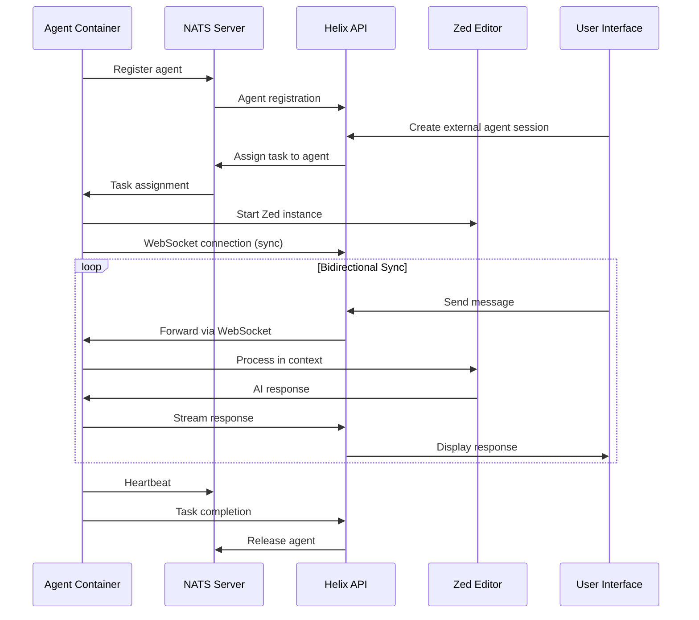

# Helix External Agents Architecture

## Overview

The Helix External Agent Architecture enables seamless integration between Helix and external development environments, specifically Zed editor instances running in containerized environments. This system provides:

- **NATS-based agent registration and scheduling**
- **Bidirectional synchronization between Zed threads and Helix sessions**
- **RDP/VNC access to visual development environments**
- **One Zed instance per SpecTask with multiple threads mapping to Helix sessions**
- **Container orchestration with auto-scaling capabilities**

## Architecture Components

### 1. NATS External Agent Service
- **Purpose**: Manages external agent lifecycle via NATS messaging
- **Location**: `api/pkg/external-agent/nats_service.go`
- **Features**:
  - Agent registration and heartbeat monitoring
  - Task assignment with load balancing
  - Automatic cleanup of stale agents

### 2. Zed-Helix Sync Service
- **Purpose**: Bidirectional synchronization between Zed contexts and Helix interactions
- **Location**: `api/pkg/external-agent/sync_service.go`
- **Features**:
  - Context mapping (Zed threads ↔ Helix sessions)
  - Real-time message synchronization
  - Response streaming and completion tracking

### 3. External Agent Runner
- **Purpose**: Runs inside agent containers to connect with control plane
- **Location**: `api/pkg/external-agent/runner.go`
- **Features**:
  - NATS-based registration and communication
  - Zed instance lifecycle management
  - WebSocket sync with Helix API

### 4. WebSocket Sync Handler
- **Purpose**: Handles real-time sync messages between Zed and Helix
- **Location**: `api/pkg/server/websocket_external_agent_sync.go`
- **Features**:
  - Context creation/update events
  - Message addition and response streaming
  - Error handling and reconnection

## Agent Lifecycle



## Session and Context Mapping

### One-to-Many Relationship
- **1 SpecTask** → **1 Zed Instance**
- **1 Zed Instance** → **Multiple Zed Threads/Contexts**
- **1 Zed Thread** → **1 Helix Session/Interaction**

### Mapping Structure
```json
{
  "spec_task_id": "spec_123",
  "zed_instance_id": "zed_inst_456",
  "helix_session_id": "session_789",
  "contexts": [
    {
      "zed_context_id": "ctx_001",
      "zed_thread_id": "thread_001",
      "helix_interaction_id": "interaction_001",
      "work_session_id": "work_001"
    },
    {
      "zed_context_id": "ctx_002", 
      "zed_thread_id": "thread_002",
      "helix_interaction_id": "interaction_002",
      "work_session_id": "work_002"
    }
  ]
}
```

## Setup and Installation

### Prerequisites
- Docker and Docker Compose
- NATS server (included in docker-compose setup)
- Rust toolchain (for building Zed)
- Node.js (for MCP servers)

### Quick Start

1. **Build everything**:
   ```bash
   ./scripts/build-external-agents.sh build-all
   ```

2. **Configure environment**:
   ```bash
   cp .env.example .env
   # Edit .env with your API token and settings
   ```

3. **Start agent pool**:
   ```bash
   ./scripts/build-external-agents.sh start-agents --agents 3
   ```

4. **Check status**:
   ```bash
   ./scripts/build-external-agents.sh status
   ```

### Manual Setup

#### 1. Build Zed with External Sync Support
```bash
# Clone Zed with external sync features
git clone --branch external-websocket-sync https://github.com/helixml/zed zed-build
cd zed-build

# Build with external sync feature
cargo build --release --features external_websocket_sync
cp target/release/zed ../zed-build/zed
```

#### 2. Build Agent Containers
```bash
# Build Zed agent container
docker build -f Dockerfile.zed-agent -t helix/zed-agent:latest .

# Optional: Build pool manager
docker build -f Dockerfile.agent-pool-manager -t helix/agent-pool-manager:latest .
```

#### 3. Start Infrastructure
```bash
# Start NATS and agents
docker-compose -f docker-compose.zed-agents.yaml up -d

# Scale agents as needed
docker-compose -f docker-compose.zed-agents.yaml up -d --scale zed-agent-1=5
```

## Configuration

### Environment Variables

#### API Server Configuration
```bash
# Enable external agent support
EXTERNAL_AGENT_ENABLED=true
NATS_SERVER_HOST=nats
NATS_SERVER_PORT=4222

# External agent timeouts
EXTERNAL_AGENT_TIMEOUT=30s
EXTERNAL_AGENT_HEARTBEAT_INTERVAL=30s
```

#### Agent Container Configuration
```bash
# Connection settings
HELIX_API_HOST=http://api:8080
HELIX_API_TOKEN=your_token_here
NATS_URL=nats://nats:4222

# Agent settings
AGENT_CONCURRENCY=2
AGENT_MAX_TASKS=10
WORKSPACE_DIR=/workspace

# Display settings
DISPLAY_WIDTH=1920
DISPLAY_HEIGHT=1080
VNC_PASSWORD=secure_password

# RDP access
RDP_USER=zed
RDP_PASSWORD=secure_password
```

### Zed Configuration
The agent containers automatically configure Zed with external sync:

```json
{
  "external_websocket_sync": {
    "enabled": true,
    "server": {
      "enabled": true,
      "host": "0.0.0.0", 
      "port": 3030,
      "enable_cors": true
    },
    "websocket_sync": {
      "enabled": true,
      "external_url": "api:8080",
      "use_tls": false,
      "auto_reconnect": true,
      "reconnect_delay_seconds": 5
    }
  }
}
```

## Usage

### Creating External Agent Sessions

#### Via API
```bash
curl -X POST http://localhost:8080/api/v1/external-agents \
  -H "Content-Type: application/json" \
  -d '{
    "session_id": "session_123",
    "user_id": "user_456", 
    "input": "Help me implement a new feature",
    "project_path": "/workspace/my-project",
    "instance_id": "spec_task_789"
  }'
```

#### Response
```json
{
  "session_id": "session_123",
  "rdp_url": "rdp://agent-1:5900",
  "rdp_password": "secure_random_password",
  "websocket_url": "ws://api:8080/api/v1/external-agents/sync?session_id=session_123",
  "auth_token": "ext_token_...",
  "status": "assigned"
}
```

### Accessing Agent Desktops

#### RDP Access
```bash
# Using rdesktop
rdesktop -u zed -p secure_password localhost:5901

# Using FreeRDP
xfreerdp /u:zed /p:secure_password /v:localhost:5901
```

#### VNC Access
```bash
# VNC viewer
vncviewer localhost:5901

# Web browser
open http://localhost:6901/vnc.html
```

### Monitoring and Management

#### Check Agent Status
```bash
# List all agents
curl http://localhost:8080/api/v1/external-agents

# Get specific agent
curl http://localhost:8080/api/v1/external-agents/session_123

# Get RDP info
curl http://localhost:8080/api/v1/external-agents/session_123/rdp
```

#### NATS Monitoring
```bash
# Connect to NATS box
docker exec -it helix-nats-box bash

# Check server info
nats server info

# Monitor streams
nats stream list
nats stream info EXTERNAL_AGENTS

# Monitor agent registrations
nats sub "external_agents.register"
```

### WebSocket Sync Protocol

#### Message Types
- `context_created`: New Zed context opened
- `message_added`: Message added to context
- `message_updated`: Message edited
- `context_title_changed`: Context renamed
- `chat_response`: Complete AI response
- `chat_response_chunk`: Streaming response chunk
- `chat_response_done`: Response completion signal
- `chat_response_error`: Response error

#### Example Sync Message
```json
{
  "session_id": "session_123",
  "event_type": "context_created",
  "data": {
    "context_id": "ctx_456",
    "title": "New Feature Implementation",
    "thread_id": "thread_001"
  },
  "timestamp": "2024-01-15T10:30:00Z"
}
```

## Development

### Adding New Agent Types

1. **Create agent executor**:
```go
type MyAgentExecutor struct {
    // Implementation specific fields
}

func (e *MyAgentExecutor) StartAgent(ctx context.Context, agent *types.Agent) (*types.AgentResponse, error) {
    // Implementation
}
```

2. **Register with NATS service**:
```go
natsService.RegisterAgentType("my_agent", myAgentHandler)
```

3. **Create container image**:
```dockerfile
FROM ubuntu:24.04
# Install your agent software
# Configure sync protocols
# Set up RDP/VNC access
```

### Extending Sync Protocols

#### Add new message types
```go
// In sync_service.go
func (s *ZedHelixSyncService) registerDefaultHandlers() {
    s.messageHandlers["my_custom_event"] = s.handleMyCustomEvent
}

func (s *ZedHelixSyncService) handleMyCustomEvent(ctx context.Context, syncMsg *types.SyncMessage) error {
    // Handle custom sync event
    return nil
}
```

#### WebSocket message handling
```go
// In websocket_external_agent_sync.go
func (apiServer *HelixAPIServer) processExternalAgentSyncMessage(sessionID string, syncMsg *types.SyncMessage) error {
    switch syncMsg.EventType {
    case "my_custom_event":
        return apiServer.handleMyCustomEvent(sessionID, syncMsg)
    // ... other cases
    }
}
```

## Troubleshooting

### Common Issues

#### 1. Agents not registering
```bash
# Check NATS connectivity
docker exec agent-container nslookup nats
docker exec agent-container telnet nats 4222

# Check agent logs
docker logs zed-agent-1

# Verify NATS streams
docker exec helix-nats-box nats stream list
```

#### 2. RDP/VNC connection issues
```bash
# Check X11 display
docker exec zed-agent-1 echo $DISPLAY
docker exec zed-agent-1 ps aux | grep Xvfb

# Test VNC server
docker exec zed-agent-1 netstat -tlnp | grep 5900

# Check supervisor status
docker exec zed-agent-1 supervisorctl status
```

#### 3. WebSocket sync failures
```bash
# Check WebSocket endpoint
curl -i -N -H "Connection: Upgrade" \
     -H "Upgrade: websocket" \
     -H "Sec-WebSocket-Version: 13" \
     -H "Sec-WebSocket-Key: test" \
     http://localhost:8080/api/v1/external-agents/sync?session_id=test

# Verify auth tokens
curl http://localhost:8080/api/v1/external-agents/session_123
```

#### 4. Zed binary issues
```bash
# Test Zed binary
docker exec zed-agent-1 /usr/local/bin/zed --help

# Check external sync feature
docker exec zed-agent-1 strings /usr/local/bin/zed | grep external_websocket_sync

# Run integration test
docker exec zed-agent-1 /test-integration.sh
```

### Performance Tuning

#### Agent Scaling
```bash
# Monitor agent utilization
curl http://localhost:8080/api/v1/external-agents | jq '.[] | {id, status, active_tasks}'

# Scale based on load
docker-compose -f docker-compose.zed-agents.yaml up -d --scale zed-agent-1=10
```

#### NATS Performance
```yaml
# In docker-compose.zed-agents.yaml
nats:
  command: 
    - "--jetstream"
    - "--max_payload=67108864"  # 64MB
    - "--max_mem_store=2GB"
    - "--max_file_store=20GB"
```

#### Container Resources
```yaml
zed-agent-1:
  deploy:
    resources:
      limits:
        cpus: '2.0'
        memory: 4G
      reservations:
        cpus: '0.5'
        memory: 1G
```

## Security Considerations

### Network Security
- All agent communication goes through NATS (encrypted in production)
- WebSocket connections require authentication tokens
- RDP/VNC access should be restricted to authorized users
- Container isolation prevents cross-contamination

### Authentication
- API tokens for NATS registration
- Session-based WebSocket authentication
- RDP/VNC password protection
- Container user isolation

### Data Protection
- Workspace data isolated per agent
- Automatic cleanup of expired sessions
- No persistent storage of sensitive data
- Audit logging of all agent activities

## Contributing

### Code Structure
```
api/pkg/external-agent/
├── executor.go           # Interface and legacy executor
├── nats_service.go       # NATS-based agent management
├── runner.go             # Agent container runner
└── sync_service.go       # Bidirectional sync service

api/pkg/server/
├── external_agent_handlers.go        # REST API handlers
└── websocket_external_agent_sync.go  # WebSocket sync

scripts/
└── build-external-agents.sh          # Build and management script

docker-compose.zed-agents.yaml        # Agent infrastructure
Dockerfile.zed-agent                   # Agent container definition
```

### Testing
```bash
# Unit tests
go test ./api/pkg/external-agent/...

# Integration tests
./scripts/build-external-agents.sh test-agents

# Load testing
# Use your preferred load testing tool against the external agent API
```

### Submitting Changes
1. Ensure all tests pass
2. Update documentation for API changes
3. Test with actual Zed containers
4. Verify NATS message compatibility
5. Check RDP/VNC accessibility

## License

This external agent architecture is part of the Helix project and follows the same licensing terms.