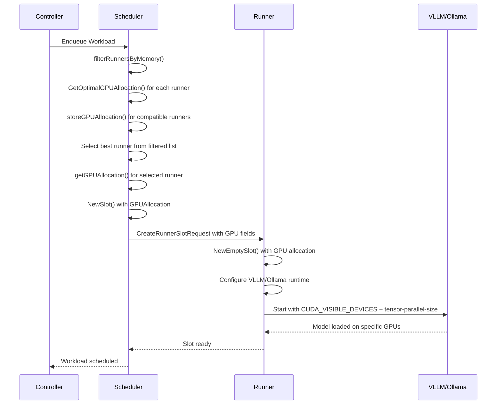
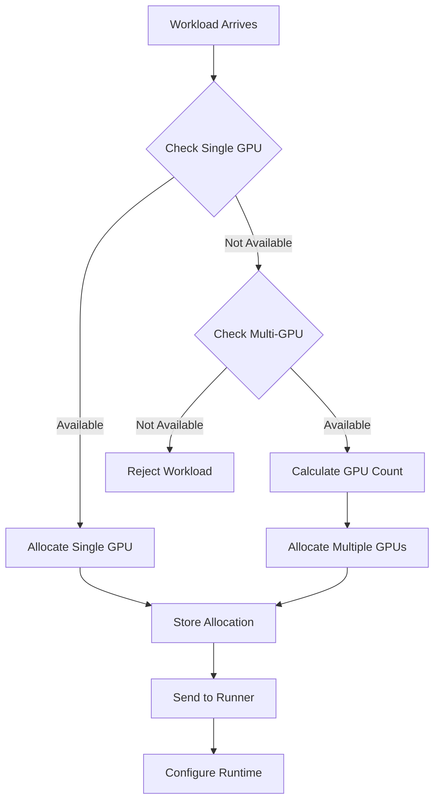

# Multi-GPU Scheduling System Design

## Executive Summary

This document describes the implementation of a centralized multi-GPU scheduling system for Helix, enabling intelligent allocation of AI models across single and multiple GPUs while maintaining consistency, preventing resource conflicts, and optimizing performance across a distributed runner infrastructure.

## 1. System Overview

### 1.1 Current Architecture (Before Multi-GPU)
```
┌─────────────────┐    ┌─────────────────┐    ┌─────────────────┐
│   Controller    │    │   Scheduler     │    │     Runner      │
│                 │    │                 │    │                 │
│ - Session Mgmt  │───▶│ - Memory Check  │───▶│ - Model Loading │
│ - API Gateway   │    │ - Runner Select │    │ - GPU Detection │
│ - Load Balance  │    │ - Slot Creation │    │ - Runtime Exec  │
└─────────────────┘    └─────────────────┘    └─────────────────┘
                                │                      │
                                ▼                      ▼
                       ┌─────────────────┐    ┌─────────────────┐
                       │ Runner Status   │    │ VLLM/Ollama     │
                       │ - Total Memory  │    │ - Default GPU   │
                       │ - Free Memory   │    │ - Memory Util   │
                       │ - Model List    │    │ - Single GPU    │
                       └─────────────────┘    └─────────────────┘
```

**Issues with Previous System:**
- GPU allocation was runner-local, creating race conditions
- No multi-GPU model support
- Memory fragmentation on multi-GPU systems
- Inconsistent allocation decisions between scheduler and runner

### 1.2 New Architecture (Multi-GPU Scheduling)
```
┌─────────────────┐    ┌─────────────────┐    ┌─────────────────┐
│   Controller    │    │   Scheduler     │    │     Runner      │
│                 │    │                 │    │                 │
│ - Session Mgmt  │───▶│ - GPU Allocation│───▶│ - Slot Creation │
│ - API Gateway   │    │ - Memory Check  │    │ - GPU Execution │
│ - Load Balance  │    │ - Multi-GPU     │    │ - Status Report │
└─────────────────┘    │ - Conflict Res. │    └─────────────────┘
                       └─────────────────┘              │
                                │                       ▼
                                ▼               ┌─────────────────┐
                       ┌─────────────────┐     │ VLLM/Ollama     │
                       │ GPU Allocations │     │ - Tensor Para.  │
                       │ - Per-GPU Info  │     │ - CUDA_VISIBLE  │
                       │ - Allocation Map│     │ - Multi-GPU     │
                       │ - Cleanup Logic │     └─────────────────┘
                       └─────────────────┘
```

## 2. Core Components

### 2.1 GPU Manager (Runner-Side)
**Location:** `api/pkg/runner/gpu.go`

**Responsibilities:**
- Detect GPU hardware using `nvidia-smi`
- Track per-GPU memory usage (total, free, used)
- Provide GPU selection recommendations
- Monitor GPU health and availability

**Key Data Structures:**
```go
type GPUManager struct {
    hasGPU        bool
    gpuMemory     uint64                // Total aggregated GPU memory
    freeMemory    uint64                // Total free memory across all GPUs
    usedMemory    uint64                // Total used memory across all GPUs
    gpuCount      int                   // Number of GPUs detected
    gpuMemoryMap  map[int]*GPUInfo      // Per-GPU tracking
    runnerOptions *Options
}

type GPUInfo struct {
    Index       int    `json:"index"`        // GPU index (0, 1, 2, etc.)
    TotalMemory uint64 `json:"total_memory"` // Total memory in bytes
    FreeMemory  uint64 `json:"free_memory"`  // Free memory in bytes
    UsedMemory  uint64 `json:"used_memory"`  // Used memory in bytes
}
```

### 2.2 GPU Allocation Engine (Scheduler-Side)
**Location:** `api/pkg/scheduler/runner.go`

**Responsibilities:**
- Make authoritative GPU allocation decisions
- Implement allocation algorithms (single-GPU, multi-GPU)
- Track memory requirements and availability
- Handle allocation failures and retries

**Key Algorithms:**
1. **Single-GPU Allocation:** Find GPU with sufficient free memory
2. **Multi-GPU Allocation:** Distribute model across multiple GPUs with 10% overhead
3. **Optimal Selection:** Try single-GPU first, fallback to multi-GPU

### 2.3 Allocation Tracking System
**Location:** `api/pkg/scheduler/scheduler.go`

**Responsibilities:**
- Store GPU allocation decisions in memory map
- Track workload-to-GPU mappings with composite keys
- Clean up allocations on workload completion and slot eviction
- Prevent double-booking of resources across runners

**Key Functions:**
- `storeGPUAllocation()`: Store allocation decision for workload-runner pair
- `getGPUAllocation()`: Retrieve allocation for slot creation
- `clearGPUAllocation()`: Clean up allocations when workloads complete
- `deleteRunnerSlots()`: Clean up allocations when runners disconnect

**Data Structure:**
```go
type GPUAllocation struct {
    WorkloadID         string
    RunnerID           string
    SingleGPU          *int   // For single-GPU models
    MultiGPUs          []int  // For multi-GPU models  
    TensorParallelSize int    // Parallelism degree
}
```

### 2.4 Runtime Integration
**Locations:** `api/pkg/runner/vllm_runtime.go`, `api/pkg/runner/ollama_runtime.go`

**VLLM Integration:**
- Set `CUDA_VISIBLE_DEVICES` environment variable
- Configure `--tensor-parallel-size` parameter dynamically
- Use scheduler-provided GPU allocation (no local GPU selection)
- Support both single-GPU and multi-GPU models

**Ollama Integration:**
- Set `CUDA_VISIBLE_DEVICES` for specific allocation  
- Allow auto-multi-GPU when no specific allocation provided
- Leverage Ollama's native automatic tensor parallelism
- Support TensorParallelSize = 0 to indicate auto mode

## 3. Data Flow and Interactions

### 3.1 Scheduling Flow


### 3.2 GPU Allocation Decision Tree


### 3.3 Memory Calculation Logic
```
Single GPU:
- Required: model_memory ≤ gpu_free_memory
- Selection: GPU with most free memory that can fit the model

Multi-GPU:
- Step 1: memoryPerGPU = model_memory / num_gpus
- Step 2: memoryPerGPU = memoryPerGPU * 1.1 (add 10% overhead)
- Required: memoryPerGPU ≤ gpu_free_memory (per GPU)
- Selection: Best GPUs with sufficient memory
- Constraint: num_gpus must divide attention heads (VLLM only)
```

## 4. API Changes and Interfaces

### 4.1 Runner Status API Enhancement
```go
type RunnerStatus struct {
    // ... existing fields ...
    GPUCount int          `json:"gpu_count"`
    GPUs     []*GPUStatus `json:"gpus"`
}

type GPUStatus struct {
    Index       int    `json:"index"`
    TotalMemory uint64 `json:"total_memory"`
    FreeMemory  uint64 `json:"free_memory"`
    UsedMemory  uint64 `json:"used_memory"`
}
```

### 4.2 Slot Creation API Enhancement
```go
type CreateRunnerSlotAttributes struct {
    Runtime                Runtime        `json:"runtime"`
    Model                  string         `json:"model"`
    ModelMemoryRequirement uint64         `json:"model_memory_requirement,omitempty"`
    ContextLength          int64          `json:"context_length,omitempty"`
    RuntimeArgs            map[string]any `json:"runtime_args,omitempty"`

    // GPU allocation from scheduler - authoritative allocation decision
    GPUIndex           *int  `json:"gpu_index,omitempty"`            // Primary GPU for single-GPU models
    GPUIndices         []int `json:"gpu_indices,omitempty"`          // All GPUs used for multi-GPU models
    TensorParallelSize int   `json:"tensor_parallel_size,omitempty"` // Number of GPUs for tensor parallelism
}
```

### 4.3 Frontend Dashboard Enhancement
- Display per-slot GPU allocation (`GPU: 0` or `GPUs: 0,1,2 (TP:3)`)
- Show multi-GPU model indicators
- Visualize GPU utilization across runners

## 5. Failure Modes and Error Handling

### 5.1 GPU Detection Failures
**Scenario:** `nvidia-smi` unavailable or GPU hardware failure
**Handling:** 
- Fallback GPU map initialization with estimated per-GPU memory
- Development CPU-only mode simulation (when `DEVELOPMENT_CPU_ONLY=true`)
- Continue operation with degraded GPU information
- Log warnings for detection failures

### 5.2 Allocation Conflicts
**Scenario:** Race condition between multiple workloads
**Handling:**
- Centralized allocation prevents conflicts
- Retry mechanism for failed allocations
- Graceful degradation to alternative runners

### 5.3 Runtime Failures
**Scenario:** VLLM/Ollama fails to start with allocated GPUs
**Handling:**
- **VLLM:** Automatic restart on process failure (maintains same GPU allocation)
- **Ollama:** GPU allocation monitoring with up to 3 restart attempts if model not fully allocated
- **Both:** Fallback to default GPU 0 if no scheduler allocation provided
- **Scheduler:** GPU allocation cleanup on slot deletion/eviction to prevent memory leaks

### 5.4 Memory Fragmentation
**Scenario:** Total memory sufficient but no contiguous GPU memory
**Handling:**
- Per-GPU memory checking prevents fragmentation
- Multi-GPU allocation as fallback
- Stale slot eviction to free resources

## 6. Performance Considerations

### 6.1 Scheduling Latency
- **GPU Status Polling:** Cached with periodic refresh
- **Allocation Decisions:** O(n) where n = number of GPUs per runner
- **Memory Calculations:** Constant time operations

### 6.2 Memory Overhead
- **Allocation Tracking:** ~100 bytes per allocation
- **GPU Status Cache:** ~50 bytes per GPU per runner
- **Cleanup Frequency:** On workload completion

### 6.3 Network Communication
- **Status Updates:** Periodic (every 5 seconds)
- **Slot Creation:** One-time per workload
- **Allocation Messages:** Minimal additional payload

## 7. Configuration and Deployment

### 7.1 Environment Variables
```bash
# Development CPU-only mode
DEVELOPMENT_CPU_ONLY=true

# VLLM GPU memory utilization (calculated dynamically)
VLLM_GPU_MEMORY_UTILIZATION=0.9

# CUDA device visibility (set by scheduler)
CUDA_VISIBLE_DEVICES=0,1,2
```

### 7.2 Model Configuration
```yaml
models:
  - name: "llama3:70b"
    memory: 42949672960  # 40GB (actual from codebase)
    runtime: "ollama"
  - name: "Qwen/Qwen2.5-VL-7B-Instruct"
    memory: 41943040000  # 39GB
    runtime: "vllm"
    runtime_args:
      - "--trust-remote-code"
      - "--max-model-len"
      - "32768"
      # tensor-parallel-size determined dynamically by scheduler
```

## 8. Monitoring and Observability

### 8.1 Metrics
- GPU utilization per runner
- Allocation success/failure rates
- Multi-GPU model distribution
- Memory fragmentation incidents

### 8.2 Logging
- GPU allocation decisions with reasoning
- Runtime configuration details
- Failure modes and recovery actions
- Performance timing information

### 8.3 Dashboard Integration
- Real-time GPU allocation visualization
- Multi-GPU model indicators
- Runner capacity and utilization
- Scheduling decision history

## 9. Testing Strategy

### 9.1 Unit Tests
- GPU detection and parsing logic
- Allocation algorithm correctness
- Memory calculation accuracy
- Error handling paths

### 9.2 Integration Tests
- End-to-end scheduling flow
- Multi-GPU model deployment
- Failure recovery scenarios
- Resource cleanup verification

### 9.3 Load Testing
- Concurrent workload scheduling
- Resource contention handling
- System stability under load
- Memory leak detection

## 10. Migration and Rollback

### 10.1 Backward Compatibility
- Existing single-GPU models continue working
- Graceful fallback for unsupported configurations
- API versioning for new features

### 10.2 Rollback Strategy
- Feature flags for multi-GPU scheduling
- Database schema backward compatibility
- Runtime parameter fallbacks

---

## Appendices

### A. Code Structure
```
api/pkg/
├── scheduler/
│   ├── scheduler.go          # GPU allocation tracking
│   ├── runner.go            # Allocation algorithms
│   └── scheduler_filters.go  # GPU-aware filtering
├── runner/
│   ├── gpu.go               # GPU detection & management
│   ├── slot.go              # Slot creation with GPU allocation
│   ├── vllm_runtime.go      # VLLM GPU configuration
│   └── ollama_runtime.go    # Ollama GPU configuration
└── types/
    └── runner.go            # API types and structures
```

### B. Configuration Examples

**Real Model Configurations (CRD format - recommended):**
```yaml
# Single-GPU Model (helix model apply -f) - supports Model, Agent, or AIApp kinds
apiVersion: model.aispec.org/v1alpha1
kind: Model  # or "Agent" or "AIApp"
metadata:
  name: qwen3:8b
spec:
  id: qwen3:8b
  name: Qwen3 8B
  type: chat
  runtime: ollama
  memory: "10GB"  # Human-readable format: 10GB, 10GiB, 10G all supported
  context_length: 40960
  description: Latest generation Qwen model with enhanced reasoning, from Alibaba - 4bit quantized, 40K context
  enabled: true

# Multi-GPU Model (helix model apply -f)  
apiVersion: model.aispec.org/v1alpha1
kind: Agent  # Alternative kind - same as Model
metadata:
  name: gpt-oss:120b
spec:
  id: gpt-oss:120b
  name: GPT-OSS 120B
  type: chat
  runtime: ollama
  memory: "80GB"  # Large model that will automatically use multiple GPUs
  context_length: 131072
  description: Large open-weight reasoning model with advanced capabilities, from OpenAI - production-grade, ~120B parameters
  enabled: true

# VLLM Multi-Modal Model (helix model apply -f)
apiVersion: model.aispec.org/v1alpha1
kind: AIApp  # Alternative kind - same as Model
metadata:
  name: qwen2.5-vl-7b
spec:
  id: Qwen/Qwen2.5-VL-7B-Instruct
  name: Qwen 2.5 VL 7B
  type: chat
  runtime: vllm
  memory: "39GiB"  # Binary units supported (GiB, MiB, KiB)
  context_length: 32768
  runtime_args:
    - "--trust-remote-code"
    - "--max-model-len"
    - "32768"
    - "--limit-mm-per-prompt"
    - '{"image":10}'
  description: Multi-modal vision-language model, from Alibaba
  enabled: true
```

**Automatic GPU Configuration:**
Helix automatically handles all GPU-related parameters:
- **GPU Selection**: Optimal GPU(s) selected based on model memory requirements
- **Tensor Parallelism**: `--tensor-parallel-size` automatically set for VLLM multi-GPU models
- **Memory Ratios**: `--gpu-memory-utilization` automatically calculated (per-GPU basis)
- **CUDA Devices**: `CUDA_VISIBLE_DEVICES` environment variable automatically set
- **Multi-GPU**: Models larger than single GPU memory automatically use multiple GPUs
- **Ollama**: Leverages native automatic multi-GPU tensor parallelism
- **VLLM**: Tensor parallel size configured based on selected GPU count

**Usage:**
```bash
# Apply model configuration (CRD format required)
helix model apply -f qwen3-8b.yaml

# Apply model from JSON CRD format (also supported)
helix model apply -f gpt-oss-120b.json

# List models to see applied configurations
helix model list

# Inspect models in CRD format
helix model inspect qwen3:8b --format yaml

# Delete models
helix model delete qwen3:8b
```

**Memory Specification:**
You only need to specify the model's total memory requirement in the `spec.memory` field using human-readable formats:
- **Binary units**: `"8GiB"`, `"16GiB"`, `"80GiB"` (powers of 1024)
- **Decimal units**: `"8GB"`, `"16GB"`, `"80GB"` (powers of 1000)  
- **Short format**: `"8G"`, `"16G"`, `"80G"` (defaults to binary/GiB)
- **Legacy numeric**: `8589934592` (bytes, still supported)

All GPU allocation, tensor parallelism, and memory ratios are calculated automatically based on available GPU resources.
