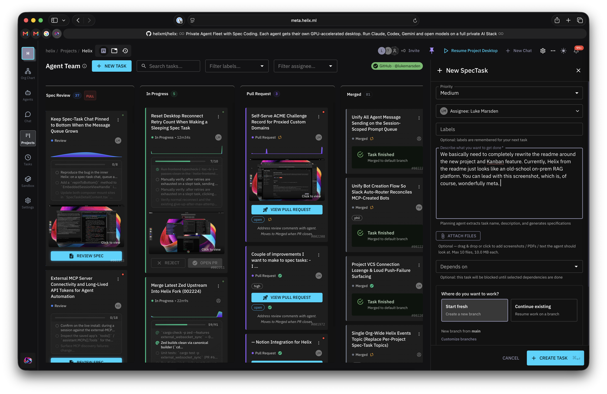

<div align="center">


<br/>
<br/>

</div>

<p align="center">
  <a href="https://app.helix.ml/">SaaS</a> •
  <a href="https://helix.ml/docs">Private Deployment</a> •
  <a href="https://helix.ml/docs">Docs</a> •
  <a href="https://discord.gg/VJftd844GE">Discord</a>
</p>

# Helix — a private agent fleet with spec-driven coding

[👥 Discord](https://discord.gg/VJftd844GE)

**Run a fleet of coding agents on your own infrastructure. Each agent gets its own GPU-accelerated desktop; you organize the work on a spec-driven Kanban board and review the pull requests.**

**It's about running agents on the server, not on every developer's laptop.** You already run Claude Code (or Codex, or Gemini) locally: one agent, one terminal, tied to your machine and your attention. You wouldn't hire a team of developers and sit them all at one laptop — so why make your agents share one? Helix gives each agent its own computer.

Helix runs those agents as a **fleet** — many in parallel, each in its own isolated sandbox with a full desktop (browser, terminal, filesystem, GUI apps), on your own infrastructure, shared with your team. You describe an outcome as a **spec task**, an agent plans it, you approve the plan, and it implements the change and opens a pull request. Instead of one person babysitting one agent in one terminal, you and your team collaboratively dispatch, steer, and review many from a shared Kanban board.

It runs with the agent harnesses you already use (Claude Code, Codex, Gemini CLI, Qwen Code, or any ACP-compatible agent) against the LLM providers you already use — including self-hosted models on your own GPUs. Self-hostable end to end, including air-gapped.



<p align="center"><em>Yes, this is meta: the task that produced this README is the "New SpecTask" open on the right.</em></p>

## Projects & the Kanban board

Work lives in **projects**. Each project connects one or more git repositories and has a Kanban board where **spec tasks** move left to right:

**Backlog → Planning → Spec Review → In Progress → Pull Request → Merged**

1. **Backlog** — Create a task with a one-paragraph description of the outcome you want (what should be true when done, not how to do it).
2. **Planning** — Click **Start Planning**. A planning agent reads the repo and writes a spec (requirements, design, task breakdown) to a `helix-specs` branch.
3. **Spec Review** — Read the plan. Highlight text to request changes and the agent re-plans, or **Approve** to commit to it.
4. **In Progress** — An implementation agent codes in its own isolated desktop sandbox. Watch it live, type into the task thread to steer it, or switch to a different agent mid-session — the new one picks up where the last left off.
5. **Pull Request** — When it's done, a PR is opened in your repo. The PR is the real review gate.
6. **Merged** — The task closes when the PR merges.

Tasks run **in parallel** — each in its own sandbox — so you're not waiting for one to finish before starting the next. Per-column WIP limits keep the board honest. See [Manage your backlog on the Kanban board](https://helix.ml/docs).

## Why Helix is different

- **A full desktop per agent — not just a terminal.** Every agent gets a GPU-accelerated streaming desktop with a browser, terminal, filesystem, and GUI apps. You can watch any agent work in real time.
- **Fleet visibility.** See every running agent from a dashboard, zoom into any one's live screen, and jump in with pair programming when it gets stuck.
- **Multiplayer.** Agent environments are shared. Teammates across time zones open the same task and keep going — full chat history and running state persist, no handoff summaries.
- **High-density isolation.** Many fully isolated agent desktops run on a single machine, with a deduplicated filesystem and per-agent credential and network isolation.
- **No lock-in.** Swap agent harnesses per task and point Helix at whatever models you run.

## Works with your stack (no lock-in)

**Agent harnesses** — use any of these per task, and swap between them mid-task:

- Claude Code
- OpenAI Codex
- Gemini CLI
- Qwen Code
- Anything that speaks **ACP (Agent Client Protocol)**

**Source control** — connect your repositories and Helix opens pull requests where your code already lives:

- GitHub
- GitLab
- Azure DevOps

**LLM providers** — hosted or self-hosted:

- Major hosted providers (OpenAI, Anthropic, …)
- **Anthropic via Helix's proxy**, including **Anthropic on Google Vertex AI** and **Anthropic on AWS Bedrock**
- **Self-hosted models** — attach any OpenAI-compatible endpoint as an external provider. This includes **[vLLM](https://github.com/vllm-project/vllm)**: point Helix at your vLLM server's OpenAI-compatible URL and run open models on your own GPUs, on Kubernetes or bare metal, air-gapped if you need to.

## Also included

Helix is a full private GenAI stack, so the pieces you'd expect are here too:

- **Knowledge / RAG** — document ingestion (PDF, Word, text), a web scraper, multiple RAG backends (Kodit, LlamaIndex), PGVector embeddings, and vision RAG.
- **Skills & tools** — REST/OpenAPI integrations, MCP server compatibility, GPTScript, OAuth token management, and a custom-tool SDK.
- **Tracing & observability** — every agent step, requests/responses to LLMs, APIs, and MCP servers, token usage, and cost analysis.
- **Multi-tenancy** — organizations, teams, and role-based access control.
- **Automation** — scheduled/cron tasks and webhook triggers.
- **Notifications** — Slack, Discord, and email.
- **Auth** — Keycloak with OAuth/OIDC.


## 🚀 Quick Start

### Install on Docker

Use our quickstart installer:

```bash
curl -sL -O https://get.helixml.tech/install.sh
chmod +x install.sh
sudo ./install.sh
```

The installer will prompt you before making changes to your system. By default, the dashboard will be available on `http://localhost:8080`.

For setting up a deployment with a DNS name, see `./install.sh --help` or read [the detailed docs](https://helix.ml/docs). We've documented easy TLS termination for you.

**Next steps:**
- Attach your own GPU runners per [runners docs](https://helix.ml/docs)
- Use any [external OpenAI-compatible LLM](https://helix.ml/docs) (including self-hosted vLLM)

### Install on Kubernetes

Use our Helm charts for production deployments:
- [Control Plane Helm Chart](https://helix.ml/docs)
- [Runner Helm Chart](https://helix.ml/docs)

## 🔧 Configuration

All server configuration is done via environment variables. You can find the complete list of configuration options in [`api/pkg/config/config.go`](https://github.com/helixml/helix/blob/main/api/pkg/config/config.go).

**Key environment variables:**
- `OPENAI_API_KEY` - OpenAI API credentials
- `ANTHROPIC_API_KEY` - Anthropic API credentials
- `POSTGRES_*` - Database connection settings
- `KEYCLOAK_*` - Authentication settings
- `SERVER_URL` - Public URL for the deployment
- `RUNNER_*` - GPU runner configuration

See the [configuration documentation](https://helix.ml/docs) for detailed setup instructions.

## 👨‍💻 Development

For local development, refer to the [Helix local development guide](./local-development.md).

**Prerequisites:**
- Docker Desktop (or Docker + Docker Compose)
- Go 1.24.0+
- Node.js 18+
- Make

**Quick development setup:**

```bash
# Clone the repository
git clone https://github.com/helixml/helix.git
cd helix

# Start supporting services
docker-compose up -d postgres keycloak

# Run the backend
cd api
go run . serve

# Run the frontend (in a new terminal)
cd frontend
npm install
npm run dev
```

See [`local-development.md`](./local-development.md) for comprehensive setup instructions.

## 📖 Documentation

- **[Overview](https://helix.ml/docs)** - Platform introduction
- **[Getting Started](https://helix.ml/docs)** - Build your first agent
- **[Manage your backlog on the Kanban board](https://helix.ml/docs)** - Projects and spec tasks
- **[Control Plane Deployment](https://helix.ml/docs)** - Production deployment guide
- **[Runner Deployment](https://helix.ml/docs)** - GPU runner setup
- **[API Reference](https://helix.ml/docs)** - REST API documentation
- **[Contributing Guide](./CONTRIBUTING.md)** - How to contribute
- **[Upgrading Guide](./charts/helix-controlplane/UPGRADE.md)** - Control plane upgrade instructions

## 🤝 Contributing

We welcome contributions! Please see our [Contributing Guide](./CONTRIBUTING.md) for details.

By contributing, you confirm that:
- Your changes will fall under the same license
- Your changes will be owned by HelixML, Inc.

## 📄 License

Helix is [licensed](https://github.com/helixml/helix/blob/main/LICENSE.md) under a similar license to Docker Desktop. You can run the source code (in this repo) for free for:

- **Personal Use:** Individuals or people personally experimenting
- **Educational Use:** Schools and universities
- **Small Business Use:** Companies with under $10M annual revenue and less than 250 employees

If you fall outside of these terms, please use the [Launchpad](https://deploy.helix.ml) to purchase a license for large commercial use. Trial licenses are available for experimentation.

You are not allowed to use our code to build a product that competes with us.

### Why these license clauses?

- We generate revenue to support the development of Helix. We are an independent software company.
- We don't want cloud providers to take our open source code and build a rebranded service on top of it.

If you would like to use some part of this code under a more permissive license, please [get in touch](mailto:info@helix.ml).

## 🆘 Support

- **[Discord Community](https://discord.gg/VJftd844GE)** - Join our community for help and discussions
- **[GitHub Issues](https://github.com/helixml/helix/issues)** - Report bugs or request features
- **[Documentation](https://helix.ml/docs)** - Comprehensive guides and references
- **[Email](mailto:info@helix.ml)** - Contact us for commercial inquiries

## 🌟 Star History

If you find Helix useful, please consider giving us a star on GitHub!

---

Built with ❤️  by [HelixML, Inc.](https://helix.ml)
