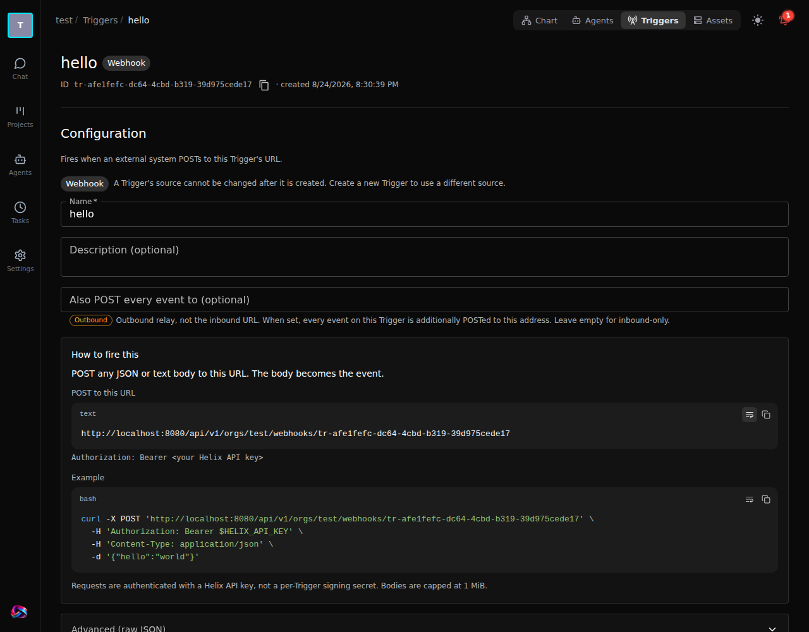
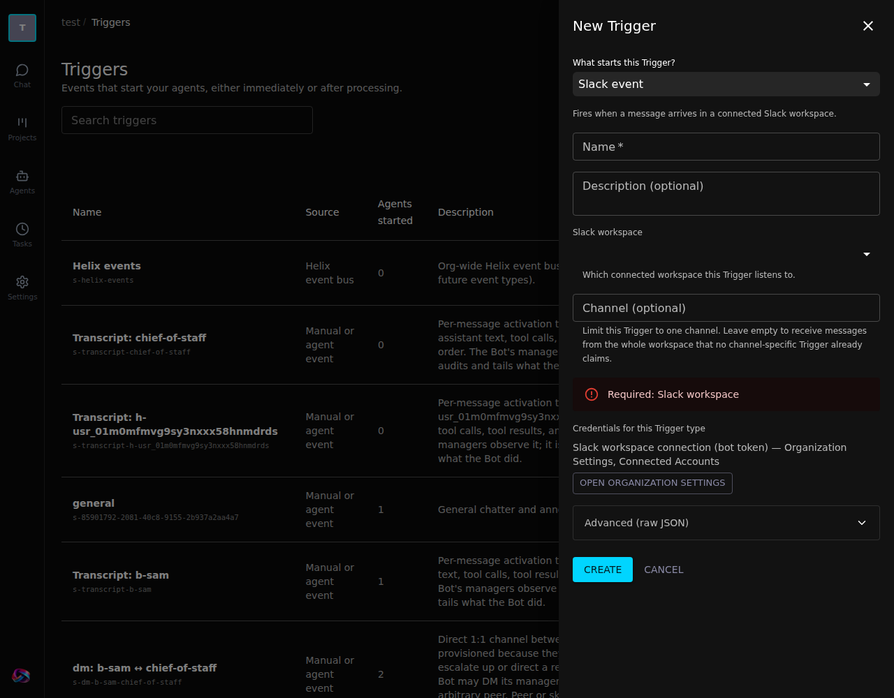
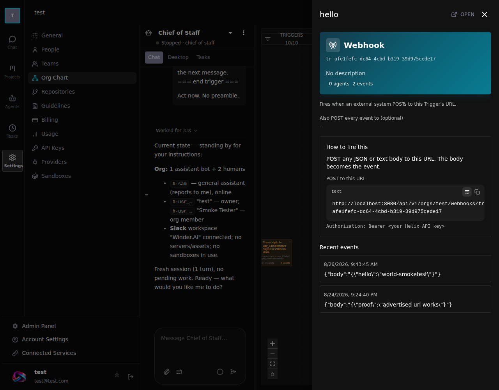

# Trigger configuration UX — verification record

Date: 2026-08-24
Plan: `docs/superpowers/plans/2026-08-24-trigger-config-ux.md`
Spec: `design/2026-08-24-trigger-config-ux.md`
Branch: `feat/trigger-config-ux`

## What was actually run

### Go

`cd api && CGO_ENABLED=1 go test ./pkg/org/... -count=1` — **48 packages ok, 0 failures.**

CGo is required: `go-sqlite3` is a stub under `CGO_ENABLED=0`, so 8 tests in
`infrastructure/persistence/gorm` fail with "Binary was compiled with
'CGO_ENABLED=0'". That is environmental and pre-existing; the same package
passes with `CGO_ENABLED=1`.

New tests, all passing:

- `TestDescribeAll_CoversEveryKindInOrder`
- `TestDescriptorRequiredFieldsAreEnforcedByValidate`
- `TestResolveActivation_FillsTemplates`
- `TestResolveActivation_FillsFieldPlaceholdersFromConfig`
- `TestResolveActivation_TrailingSlashOnPublicURLDoesNotDouble`
- `TestResolveActivation_MissingFieldLeavesReadablePlaceholder`
- `TestResolveActivation_LocalHasSummaryButNoURL`
- `TestWebhookPostResolvesOrgFromContextWhenPathHasNoOrgSegment`
- `TestListTriggerKindsReturnsEveryKindWithLabels`
- `TestTriggerDTOCarriesResolvedActivation`

### Frontend

`./node_modules/.bin/vitest run --no-file-parallelism` — **1022 passed, 1 skipped,
0 failed, exit 0.**

Two traps worth recording:

- Running vitest **inside the frontend container fails misleadingly**. Only
  `vite.config.ts` is mounted at `/app`, not `vitest.config.ts`, so the jsdom
  environment is never applied and every DOM test dies with "document is not
  defined". Run vitest on the host.
- With default file parallelism this machine reports ~173 *file* failures while
  still reporting **zero test failures** — a resource artifact, not real
  breakage. `--no-file-parallelism` is green.

`yarn build` succeeds.

## End-to-end in the browser (http://localhost:8080)

### The two kinds that could not be created at all

Both now create. Confirmed in Postgres:

```
tr-70f74aa1-… | uxprobe-ui-slack | slack | {"service_connection_id":"782bce22-…"}
tr-4ca25f35-… | uxprobe-email    | email | {"alias":"uxprobe"}
```

The slack row was created **through the UI**, not the API: New Trigger →
"Slack event" → the workspace dropdown resolved the real connected workspace
("Winder.AI / T5AQP0ARY") → Create. Before this change that form was a `{}`
textarea and submitting it returned
`400 slack transport: service_connection_id is required`.

The form also shows `Required: Slack workspace` **before** submit, rather than
surfacing the constraint as a server 400.

### The webhook URL round-trip

The detail page for `tr-afe1fefc-…` (the Trigger from the original report)
displays:

```
POST  http://localhost:8080/api/v1/orgs/test/webhooks/tr-afe1fefc-…
      Authorization: Bearer <your Helix API key>
```

POSTing to that URL verbatim returned `200` with an event id, and the event
appears under Event history. The same single-org URL returned `404` before the
route fix, because the handler read `PathValue("org")` raw and the doubled-org
form required the canonical `org_…` id. Unauthenticated requests still `401`.

### Read-only config survives a save

A GitHub Trigger seeded with `webhook_id: 424242` and `webhook_html_url` was
opened in the UI, its branches changed from `["main"]` to
`["main","release/*"]`, and saved. Postgres afterwards:

```
branches         : ['main', 'release/*']
webhook_id       : 424242
webhook_html_url : https://github.com/helixml/helix/settings/hooks/424242
```

Both server-managed keys survived. This is the regression `draftToConfig`
exists to prevent.

### Name prominence

The detail page heading is now `heading "hello" [level=5]` with a `Webhook`
chip beside it; the id sits in a caption row with a copy button. Previously the
id was the monospace `h5` and the name a grey `body2` subtitle.

Kind labels render as "Webhook", "GitHub event", "Slack event", "Manual or agent
event" instead of the raw enum strings.

The webhook Kind's only field now reads "Also POST every event to (optional)"
with an **Outbound** chip and the explanation "Outbound relay, not the inbound
URL." — the trap named explicitly.

## NOT tested

- **GitLab** — no GitLab repository is connected to this org, so
  `GitLabRepoPicker` and `GitLabEventsField` were never rendered against real
  data. Their code compiles and typechecks; that is all.
- **Email delivery** — `transport.postmark` is not configured here. The `alias`
  field and the composed activation address were verified; no mail was sent or
  received.
- **GitHub webhook installation** — the Helix GitHub App is not installed on
  this org (`/github/repos` returns 412, which the page reports honestly). The
  GitHub Trigger was seeded via the API rather than through a real install, so
  `TriggerWebhookPanel`'s live-status path was exercised only in its
  "couldn't confirm, showing last-known state" branch.
- **Cron firing** — the schedule editor renders on every surface, but no
  scheduled fire was observed.
- **The org-chart side pane** was not opened in the browser. `TriggerConfig` is
  wired into it at `density="compact" mode="read"` and typechecks, but the
  rendered result was not seen.

## Deviations from the plan

**Task 10 (drop `id` from the MCP `create_trigger` tool) was reverted, not
completed.** It was marked optional in the plan. Removing the argument broke four
tests that deliberately create Triggers with readable ids
(`TestDemoOwnerCreatesCEO`, `TestAttachOtherWorkers`, `TestTopicMembers`,
`TestReadsOverMCP`). Since ids were explicitly de-scoped — they stay internal and
stay in URLs — the churn buys nothing user-visible, so it was reverted. The `s-`
vs `tr-` inconsistency for agent-created Triggers remains.

The detail page's Cancel/discard button was reimplemented as a remount key,
since `TriggerConfig` now owns the draft state.

## Screenshots

Captured against the running dev stack at `localhost:8080`, after the fixes from
both review rounds.

### Trigger detail — webhook

The same Trigger from the original report. The name leads with the kind's human
label beside it; the id is a copyable caption rather than the headline. The
`outbound_url` field is marked **Outbound** and says so in words. "How to fire
this" carries the payload URL, the auth header, and a pasteable curl.



### New Trigger — Slack

Previously a `{}` textarea that could not produce a valid Slack Trigger. Now the
required workspace picker, the optional channel, an up-front "Required" alert
rather than a server 400, and where the credentials live. The list behind it
shows human kind labels instead of raw enum strings.



### Org-chart side pane

Previously name, id, description and two counts. Now the same `TriggerConfig`
the detail page uses, at compact density, so the pane cannot show less than the
page.


