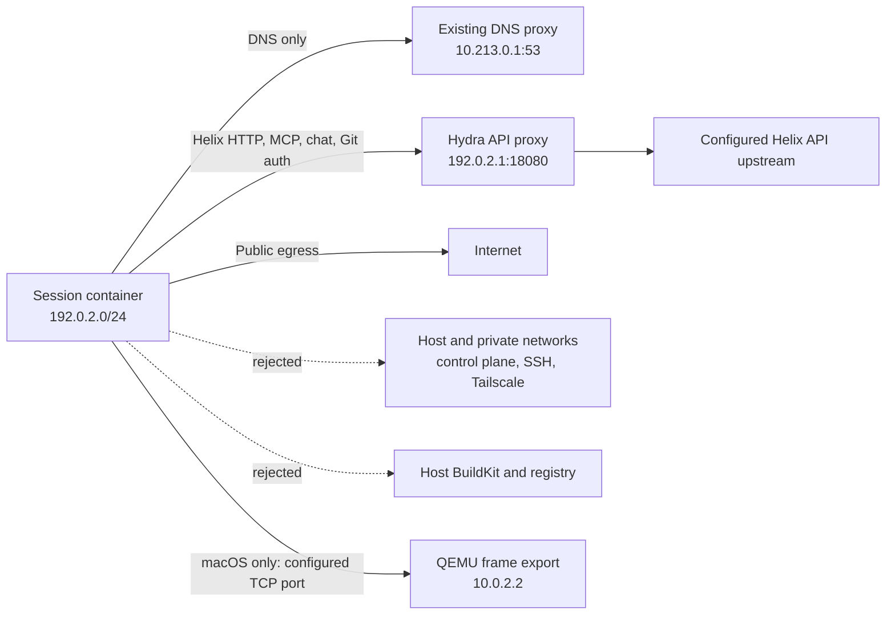

# Sandbox egress hardening

## Runtime topology

Hydra owns both the session-container lifecycle and the fixed API proxy. The
existing dockerd lifecycle owns the bridge and firewall. No additional service,
sidecar, or policy supervisor is introduced.

## Policy lifecycle

1. Before dockerd starts, install a source-subnet reject guard. This covers
   persistent containers that Docker restores automatically.
2. Start dockerd and create or verify the fixed `helix-sandboxes` bridge.
3. Rebuild complete IPv4 and IPv6 policy chains from scratch, then install their
   hooks at the front of the built-in chains.
4. Remove the bootstrap guard only after all hooks are active and publish the
   network-ready marker.
5. Repeat the same sequence whenever the existing dockerd restart loop restarts
   the daemon.

Ordered chain replacement prevents operator allow rules from being appended
behind terminal reject rules. IPv6 is rejected when available and explicitly
skipped when the kernel has IPv6 disabled.

## Compatibility boundaries

- DNS remains routed through the existing depth-aware DNS proxy, including an
  operator-provided `DNS_UPSTREAM`.
- All `/api/v1/mcp` routes are rewritten to the Hydra proxy regardless of the
  user-selected MCP name. Direct third-party MCP URLs are unchanged.
- Provider base URLs are rewritten only when they already target Helix; direct
  external OpenAI-compatible and Anthropic endpoints are preserved.
- macOS permits only the configured frame-export TCP port on `10.0.2.2`, not the
  surrounding private range.
- A running pre-upgrade session is not killed during reconciliation. It keeps
  its current network until its next normal restart; a stopped legacy container
  is recreated on the isolated bridge.
- The unused privileged shared BuildKit container is no longer provisioned. It
  is retired after the last pre-upgrade container referencing it is gone, while
  its persistent cache volume is preserved. The registry remains host-side for
  Hydra image recovery and is blocked from sessions.

## Validation matrix

The release gate is a rebuilt sandbox image plus live checks for desktop and
headless session creation, chat/MCP traffic through the API proxy, public DNS
and HTTPS, private/control-plane rejection, local Docker builds, dockerd restart
reconciliation, and preservation of an already-running legacy session.

Validated locally on 2026-08-30:

- Rebuilt both desktop and sandbox images, then completed a clean sandbox boot.
- Created fresh headless and desktop spec tasks and completed follow-up chat
  turns in both.
- Invoked `current_session` and `list_windows` from inside the respective agents,
  proving the generated MCP routes work through the constrained proxy.
- Captured a live desktop frame with GNOME and Zed running.
- Built and ran a Docker image inside both session types.
- Confirmed public DNS/HTTPS and rejected direct API, Postgres, registry, and
  host SSH connections from real session containers.
- Reconciled the policy across a dockerd restart while a persistent test
  container continuously attempted new private connections; none succeeded.
- Exercised both upgrade states through Hydra: a running legacy-bridge
  container retained its ID and start time, while a stopped legacy container
  was recreated on `helix-sandboxes`.
- Confirmed an operator allow CIDR and the single macOS frame-export port are
  ordered before private-range rejects.
