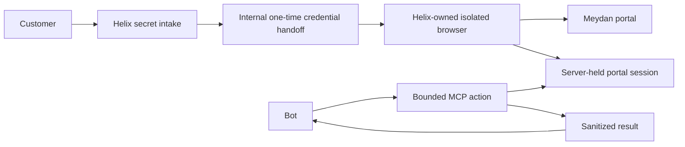

# Meydan website login: secret intake to a bounded bot connection

**Status:** design; no Meydan adapter or authenticated portal test has been built. The initial target is the Customer Portal at `portal.meydanfz.ae`, using the owner's personal account for a read-only prototype. No payment, application submission, profile change, document upload, or other business-state mutation is in scope.

The [Connect prior-art and hardening review](2026-09-26-connect-prior-art-and-hardening.md) records lessons from Nango's implementation and public issue reports. Its attempt-generation, customer-binding, submission-capability, status-reconciliation, and key-rotation requirements apply before this design is used with real portal credentials.

## Verified context and choice

The [Meydan Free Zone home page](https://www.meydanfz.ae/) links its **Customer Portal** to `https://portal.meydanfz.ae/frontend/login`. This is the target; the separately linked Channel Partner Portal is out of scope. The public login page does not establish its form selectors, OTP sequence, session behavior, or terms for automated access. Observe those with the owner's account during a controlled, redacted walkthrough. Ownership of the account authorizes this prototype's read-only exploration, but does not establish vendor permission for a production credential-delegation service.

Meydan's [security guidance](https://www.meydanfz.ae/security) tells customers that Meydan will never ask for passwords or OTPs and warns about lookalike sites and messages. A Helix-branded page requesting the same credentials could train customers to do the opposite of that guidance. For the owner's prototype, the requested **intake-to-form handoff** is the primary design: it needs explicit consent to Helix receiving the factors and a review of the portal's access terms. It must identify Helix as the recipient and must never appear to be a Meydan login page. An alternative lets the owner type into the real Meydan page inside a **Helix-owned remote browser**; it is not a redirect to the owner's ordinary browser. If Meydan offers delegated access or an approved API, use that for a customer-facing rollout.

In both paths, Helix owns the browser context that becomes authenticated. A login in the owner's ordinary local browser would leave the connector unauthenticated and is not part of this design. The bot accesses the resulting session only through Helix's bounded tools; it does not receive cookies or browser control.

## Trust boundary

The browser worker is a new *workload within existing Helix infrastructure*, not a coding-agent desktop or shared crawler. Helix can reuse Hydra/container orchestration, but this worker has no LLM client, Chrome DevTools MCP, Helix user API key, shared workspace volume, or generic agent tool access. The bot never receives browser CDP access, a password, OTP, cookie, or reusable bearer URL.

Each connection attempt is bound by the backend to `{organization, project, authenticated customer, conversation, portal kind, attempt generation}`. A model-supplied `customer_id`, `project_id`, or `intake_id` cannot establish that binding. The gateway must derive customer and conversation from its authenticated session; the connector checks the binding again on every action. The current generic intake API accepts customer and conversation strings supplied by its caller, so this stronger binding is required before a customer-facing Meydan flow. A replacement attempt increments the generation; a late worker result from an older attempt cannot activate a connection.

## Prototype path: Helix intake fills the Meydan form

Use this for the personal-account prototype only after the account owner explicitly consents to Helix receiving the factors and the portal's access terms have been reviewed. Do not infer permission for customer-facing deployment from a personal-account test.

1. The backend creates a `meydan` connection attempt and a linked `secret_intake` with the exact fields `username` and `password`. The bot receives an invitation URL and status only. The intake page clearly identifies Helix as the party receiving the values and identifies the destination portal. No Meydan branding is used to imply the form is hosted by Meydan.
2. The form posts directly to Helix. The submitted values are encrypted. An internal login coordinator atomically **claims** the intake with a short lease and pins it to one worker and connection attempt. It sends the values over an authenticated, encrypted, short-lived worker channel. Values do not enter a queue payload, command line, environment variable, workspace file, screenshot, tracing span, or model-visible tool result.
3. The worker opens the fixed, approved Meydan URL, validates the HTTPS origin and redirect chain, fills the identified login fields, and submits once. It reports a typed result: `invalid_credentials`, `otp_required`, `connected`, `human_challenge`, or `portal_changed`. It cannot navigate to a bot-supplied address. Additional login/SSO origins must be explicitly reviewed and allowlisted.
4. If OTP is required, Helix requests a separate, attempt-bound short-lived intake or gives the customer control of the same isolated browser. The worker submits the OTP directly to the portal. OTP is immediately deleted after use. Keep the password only if the portal truly requires it again during the challenge, encrypted and with a short expiry; otherwise clear it once the first step is accepted.
5. On success, the coordinator acknowledges consumption, clears the original intake ciphertext and transient factors, and records an encrypted, customer-bound portal session or keeps the **same authenticated browser context** alive for a short fixed lifetime. The bot calls narrow connector tools against that session; the bot itself never handles the session cookie. On failure or lease timeout, the coordinator either retries idempotently within a small cap or requires a fresh intake. Never replay a password indefinitely.

The current `ConsumeSecretIntake` callback in `api/pkg/server/secret_intake_handlers.go` runs inside a database transaction. It is suitable for a short in-process handoff, not a network login. Refactor it to a claim/lease/ack protocol before connecting it to a browser worker, so a slow portal response cannot hold a database lock and a crashed worker has a defined recovery path.

The proposed internal handoff contract is:

| Step | Caller | Data crossing the boundary |
|---|---|---|
| `claim(intake_id, connection_id, worker_id)` | Login coordinator | IDs only; atomically verifies the intake belongs to this customer and is `submitted`, then assigns a short lease. |
| `redeem(lease_id)` | The named worker over an authenticated internal channel | Username/password once; the lease is bound to that worker and connection and expires quickly. No public HTTP or MCP route exposes this call. |
| `report(lease_id, typed_outcome)` | Worker | Status and opaque browser-session handle only. Successful or terminal outcomes clear intake ciphertext. |

A submission event contains only the intake and connection IDs; it never contains values. If the worker dies before redemption, the coordinator can reassign the lease. If it dies after submitting to Meydan and before reporting the outcome, the result is uncertain: stop and ask the owner to reconnect rather than silently replay the password. A portal session handle is usable only by the connector, never by the bot or a generic browser tool.

## Alternative: direct entry in the Helix-owned browser

1. The bot asks for a Meydan connection. The trusted gateway creates a connection attempt for the authenticated customer. The server chooses the configured, exact Meydan portal origin; the bot cannot supply a URL.
2. Helix starts a dedicated, empty browser context on its worker. It opens the configured portal and streams that same browser to the customer, with the canonical destination origin displayed separately in trusted Helix UI. The customer does not open a separate local-browser session. No page content is forwarded to the bot or LLM during sign-in.
3. The customer enters username, password, and any OTP into the Meydan page in that browser. The browser stream and input relay must not persist keystrokes, frames, network bodies, DOM snapshots, or console output. The worker is the only component with browser control. If a CAPTCHA, passkey, or other human challenge appears, the customer completes it; the automation does not bypass it.
4. The worker verifies a narrowly defined signed-in signal from the controlled walkthrough, preserves only the authenticated browser context or encrypted session state needed for later actions, and reports `connected`. It clears transient input state. The bot receives only a connection ID and status.
5. Later MCP tools such as `get_meydan_application_status` resolve the current customer, use the server-held session, perform one allowlisted operation, and return a small structured result. A generic navigate/click/screenshot tool is not exposed to the bot for this session.

This path avoids a Helix password form while still leaving the connector with an authenticated browser session. Helix operates the remote browser and input transport, so its infrastructure remains in the trust boundary and must be disclosed accurately.

## Session and action policy

- One browser context per customer connection. No cross-customer profile, cookies, cache, local storage, mounts, or CDP endpoint. Run without an agent. Give the worker only a narrow internal service identity and outbound access to reviewed Meydan/SSO origins; block arbitrary egress and metadata services.
- Encrypt any persisted portal cookies/session material with a key outside the database. Bind it to the portal, project, customer, and connection. Use a short idle and absolute expiry and support immediate revoke. A first prototype can keep the context in memory and require reconnection after worker restart.
- The first bot action is a read-only account overview or status lookup selected after observing the portal. Each action is a separate typed MCP tool or tightly validated operation enum. The tool resolves the connection from trusted customer context and checks its permitted action. Responses contain only expected fields; portal HTML, arbitrary DOM text, cookies, and browser screenshots are not model output. The worker has no generic click or navigation operation for the bot and rejects every unreviewed action, especially actions that create or change portal data.
- Use a small state machine: `awaiting_user -> credentials_submitted -> logging_in -> otp_required -> connected`, with `failed`, `expired`, and `revoked` terminal states. Cap password and OTP attempts; serialize concurrent submissions; audit only IDs, timestamps, state changes, and action names.
- Stop and surface a safe status if the portal adds an unexpected redirect, CAPTCHA, changed form, account chooser, or new security challenge. Do not automate around anti-bot controls.

## Concrete next implementation slice

1. Use the owner's account to record the real login/OTP/redirect sequence without secrets in test artifacts. Confirm the portal's published access terms and the chosen access method before any customer-facing rollout. Do not use the Channel Partner Portal.
2. Add server-derived customer/conversation binding, a durable connection record, and a generation-specific connection-attempt record tied to each intake. Give external submitters a narrow one-attempt write capability instead of a project-wide key. Change `ConsumeSecretIntake` to an internal claim/lease/ack handoff.
3. Build the no-agent browser worker and a deterministic Meydan login adapter behind a feature flag. Test only against the owner's account with explicit read-only scope. Keep credential forms and authenticated browser state out of existing agent desktops and crawler pools.
4. Add one safe post-login read operation, for example an application status if the account has one, plus revoke and expiry. Explicitly reject payments, submissions, edits, uploads, deletions, and downloads of sensitive documents. Make stored state authoritative so a lost notification cannot strand the UI or create a duplicate connection. Verify with network traces and log scans that factors and session material never reach MCP outputs, chats, task workspaces, screenshots, or telemetry.

Until the portal behavior and access terms have been checked, the generic intake should not be presented as a Meydan credential collection page to other customers.
