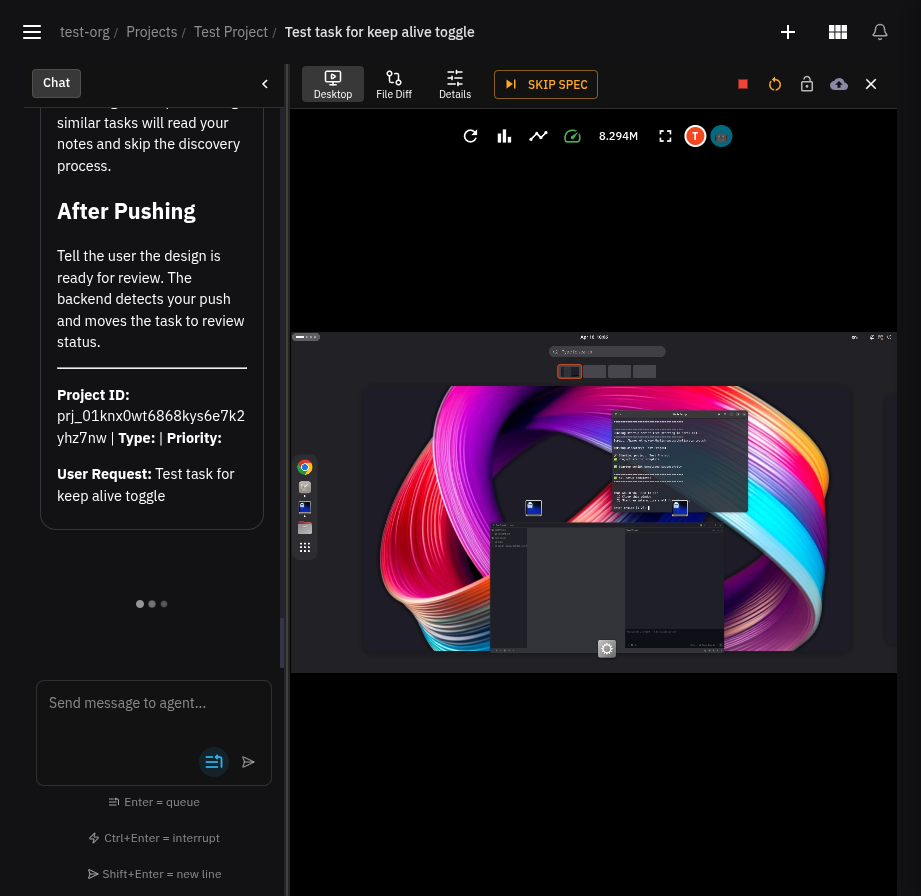
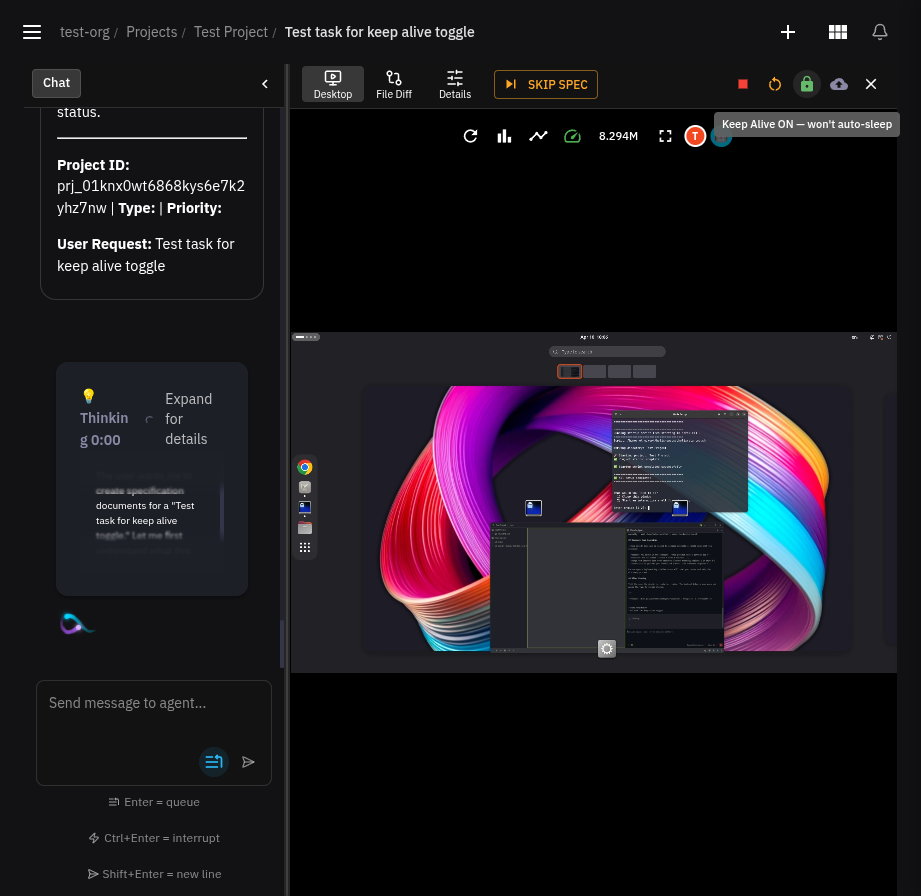

# Add "Keep Alive" toggle to prevent spectask auto-idle-shutdown

## Summary
Adds a toggle button to the spectask detail page that prevents the container from being auto-stopped by the idle checker. This is useful for desktop environments where active browser sessions (e.g. LinkedIn) lose their logged-in state when containers are stopped after the idle timeout.

## Screenshots

**Keep Alive OFF** (default — grey unlock icon in toolbar):

**Keep Alive ON** (green lock icon, tooltip confirms):

## Changes
- **Model**: Added `KeepAlive` bool field to `SpecTask` struct and `SpecTaskUpdateRequest`
- **Idle checker**: Added `NOT EXISTS` filter to `ListIdleDesktops` SQL query to skip sessions whose parent spectask has `keep_alive=true`
- **Handler**: Handle `KeepAlive` in `updateSpecTask`, clear on backlog reset
- **Frontend**: Lock/unlock toggle button in detail page toolbar (green lock = active, grey unlock = inactive), visible when desktop is running
- **Test**: Added test case verifying keep-alive tasks are excluded from idle desktop list
- **OpenAPI**: Regenerated swagger specs and TypeScript client
