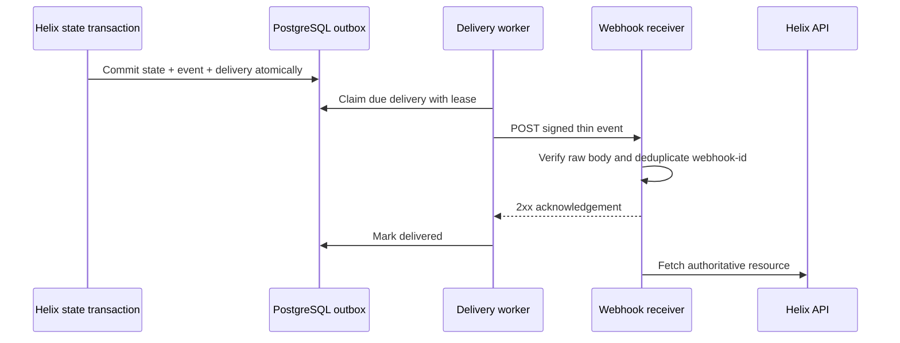

# Standard Webhooks

Helix emits durable, signed outbound notifications for spec-task and artifact changes. The implementation follows the [Standard Webhooks specification](https://github.com/standard-webhooks/standard-webhooks/blob/main/spec/standard-webhooks.md).

Webhooks are wake-up signals, not a second source of truth. A receiver should verify and deduplicate the notification, acknowledge it quickly, then fetch the referenced task or artifact from the Helix API before acting.



## Events

- `spec_task.created`
- `spec_task.status_changed`
- `artifact.published`

Endpoints may subscribe to individual events or `*`, and may be scoped to one project. Payloads contain identifiers and routing/status metadata only. The `id` in the JSON body identifies the immutable event; the `webhook-id` header identifies the endpoint delivery and remains unchanged across retries.

```json
{
  "id": "whevt_...",
	"api_version": "v1",
  "type": "spec_task.status_changed",
  "organization_id": "org_...",
  "project_id": "project_...",
  "data": {
    "spec_task_id": "task_...",
    "project_id": "project_...",
    "organization_id": "org_...",
    "status": "done"
  },
  "timestamp": "2026-09-22T12:00:00Z"
}
```

Every request includes `webhook-id`, `webhook-timestamp`, `webhook-signature`, and `webhook-type`. Verification must use the exact raw request body. Signing secrets use the `whsec_` format and are returned only when an endpoint is created or rotated; Helix stores them encrypted. Rotation has a 24-hour overlap in which the signature header contains signatures from both keys.

## Management API

Organization owners manage endpoints under:

```text
GET    /api/v1/organizations/{org}/webhook-endpoints
POST   /api/v1/organizations/{org}/webhook-endpoints
PUT    /api/v1/organizations/{org}/webhook-endpoints/{endpoint}
DELETE /api/v1/organizations/{org}/webhook-endpoints/{endpoint}
POST   /api/v1/organizations/{org}/webhook-endpoints/{endpoint}/rotate-secret
GET    /api/v1/organizations/{org}/webhook-endpoints/{endpoint}/deliveries
POST   /api/v1/organizations/{org}/webhook-endpoints/{endpoint}/deliveries/{delivery}/replay
```

Example creation request:

```json
{
  "url": "https://cyber.example.com/api/ptaas/webhooks/helix",
  "description": "Cyber PTaaS reconciliation wake-up",
  "project_id": "project_...",
  "events": ["spec_task.status_changed", "artifact.published"]
}
```

Copy the returned `secret` directly into the receiver's secret store. It is not shown again.

## Delivery behavior

- State mutation and outbox enqueue occur in one database transaction.
- Delivery is asynchronous with a bounded-concurrency worker and a database lease, so multiple API replicas do not intentionally process the same attempt.
- `2xx` marks a delivery successful. Redirects are not followed. `410 Gone` disables the endpoint.
- Failures retry eight times by default with exponential backoff and jitter over several days. `Retry-After` is honored.
- Delivery history exposes status, attempt count, response status, a sanitized error category, and replay controls.
- HTTPS and public destinations are required. DNS is resolved again at connection time and private, loopback, link-local, multicast, and unspecified addresses are rejected to prevent SSRF.

For local development only, set `WEBHOOK_ALLOW_PRIVATE_ENDPOINTS=true` to allow HTTP and private/loopback destinations. Never enable that setting on an Internet-facing deployment.
